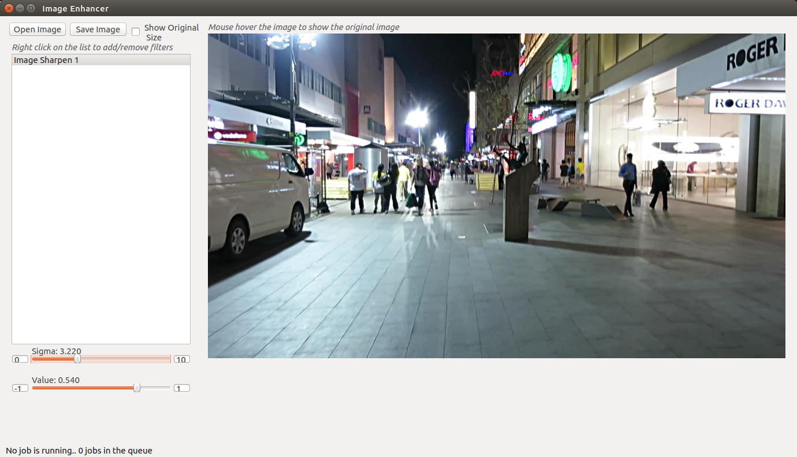

# Image Enhancer

This application is an image enhancement application based on `OpenCV` and `PyQt4`. You can use this as a small image enhancement software for day-to-day work.
But I created this to do pre-processing for images before feeding into a Neural Network. You can open a sample image and do enhancements and note down the parameters. Then you can use them in your own application.

## Add Custom Filters

If you want a custom filter to be added other than the filters that are implemented here, you can do it too. You just need to create a new filter class by inheriting `filters/abstract_filter.py` class and add it to the `filters` folder. <br> Then after you start application the filter will automatically be there. You can find more details in the documentation of `filters/abstract_filter.py` file.

## Working with the application

* Click open image button and open a image file you want
* Right click on the list and add a filter(s) you want
* Click on a filter and then change the values of the sliders below to change the effect of the selected filter
* You can change the maximum and minimum values of the slider using the text boxes.
* You can mouse hover in the image to see the original image
* You can remove a filter by right clicking on a filter in the list
* Finally you can save your output image

Tested with PyQt4 with Python 3.5 and Python 2.7 (Master brach is with Python 3.5 support and for Python 2 there is another branch)

## Requirements
* Python
* PyQt4
* OpenCV 3.x
* Numpy

## Run the program
You can run the program by

```python
python main.py
```
Output of the application is shown below


